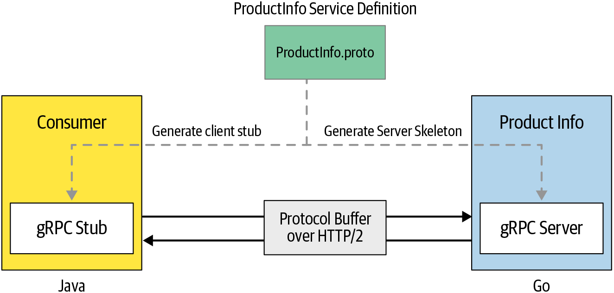

# gRPC

## [Documentation](docs/README.md)

- [Install](docs/install.md) gRPC
- gRPC
- Helloworld
- Product Info Servicemd)
  - Create go modules: server, client
  - Write and compile a protobuf for go interface
  - Build and run server and client
- gRPC patterns
  - Unary RPC
  - Server streaming RPC
  - Client streaming RPC
  - Bidirectional streaming RPC
- Basic
  - RPC
  - Message Encoding
  - Length-Prefix Message Framing
  - HTTP/2
  - gRPC Layer
- Advanced
  - Interceptors
    - server/client 
    - unary/stream interceptor
  - Deadline
  - Cancellation
  - Error Handling
  - Multiplexing
  - Metadata
  - Load Balancing, Name Resolve
  - Compression
- Secure
  - basic authentication
  - mTLS
  - OAuth 2.0
- Production
- Ecosystem
  - microservices architecture

---
## Ref

### gRPC

- [gRPC](https://grpc.io/)
  - [documentation](https://grpc.io/docs/)
  - [introduction](https://grpc.io/docs/what-is-grpc/introduction/)
  - quickstart: [golang](https://grpc.io/docs/languages/go/quickstart/)
- github: [grpc](https://github.com/grpc/grpc)
  - [doc](https://github.com/grpc/grpc/tree/master/doc)
  - [status codes](https://grpc.github.io/grpc/core/md_doc_statuscodes.html)
- github: [grpc/grpc-go](https://github.com/grpc/grpc-go)
- protocol buffers: [google doc](https://developers.google.com/protocol-buffers)

### Book

- book: [gRPC - Up and Running](https://grpc-up-and-running.github.io/)
  - [github](https://github.com/grpc-up-and-running)
    - [content](https://github.com/grpc-up-and-running/grpc-up-and-running.github.io)
    - [samples](https://github.com/grpc-up-and-running/samples)
  - oreilly: [ch01](https://www.oreilly.com/library/view/grpc-up-and/9781492058328/ch01.html)

### Documentation

- Microsoft: [gRPC](https://docs.microsoft.com/en-us/dotnet/architecture/cloud-native/grpc)
